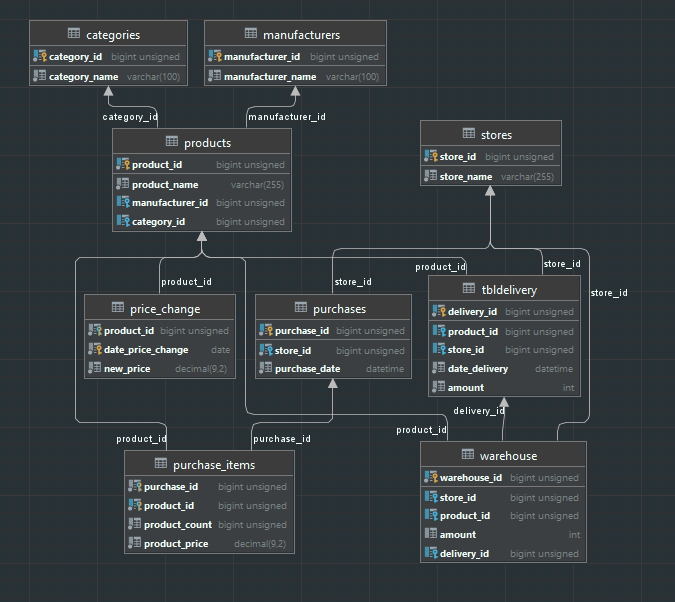

# Sasai Kudasai
## Задачи бизнес - логики
1) Оформление продажи товара
2) Оформление возврата товара
3) Оформление поставки товаров
4) Добавление новых поставщиков + товаров
5) Изменения цен

## Условия
* Имеется одно большое приложение
* Остальные приложения являются динамическими библиотеками - формами для основного приложения

## Дополнительно
* Под приложения создан аккаунт в базе данных ```'dev'@'%'```
* Желательно, чтобы приложения выглядели ***НАРМАЛЬНА***!!!
* 
